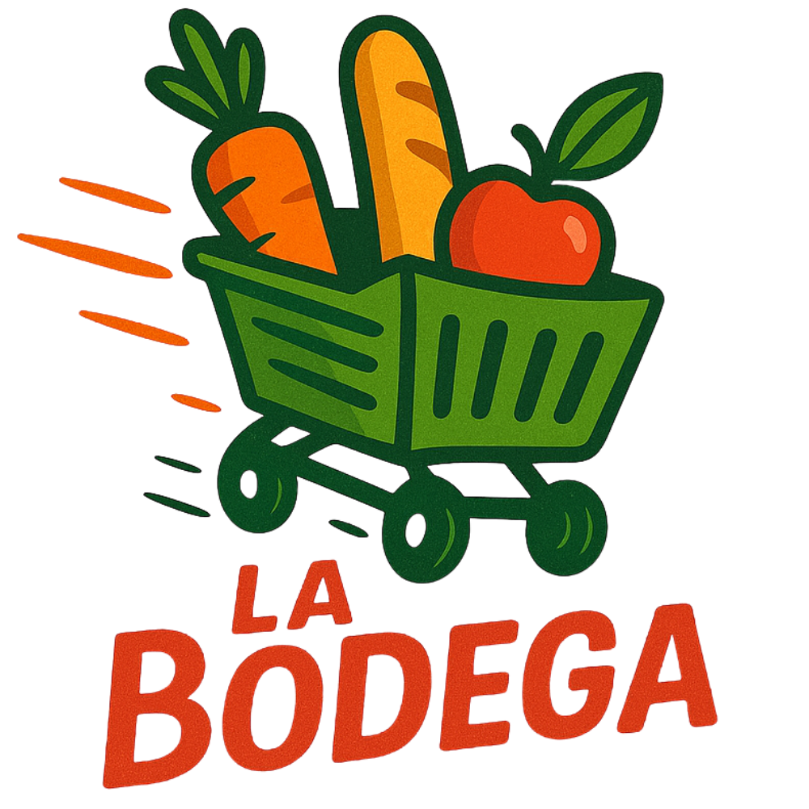

# 📦 Sistema de Bodega — Arquitectura Orientada a Servicios (SOA)



Sistema integral de gestión para bodegas desarrollado con **Next.js 15**, **React 19**, **TypeScript** y **Supabase**, implementando una arquitectura orientada a servicios (SOA) para garantizar modularidad, escalabilidad y mantenibilidad.

---

## 🎯 Descripción del Proyecto

**La Bodega** es un sistema de punto de venta (POS) y gestión de inventario diseñado específicamente para pequeños negocios de abarrotes. El sistema permite gestionar ventas, compras, clientes, proveedores, productos y usuarios de manera eficiente, con control de roles y permisos.

### ✨ Características Principales

- 🛒 **Sistema POS Completo**: Interfaz intuitiva para registro rápido de ventas
- 📊 **Gestión de Inventario**: Control automático de stock con alertas de bajo inventario
- 👥 **Multi-usuario con Roles**: Sistema de permisos para ADMIN y VENDEDOR
- 💰 **Registro de Compras**: Control de adquisiciones con actualización automática de stock
- 📈 **Historial y Reportes**: Consulta detallada de ventas y compras realizadas
- 🔐 **Autenticación Segura**: Sistema de login con Supabase Auth
- 📱 **Diseño Responsivo**: Interfaz adaptable a diferentes dispositivos

---

## 🏗️ Arquitectura Orientada a Servicios (SOA)

El proyecto implementa SOA para separar la lógica de negocio en servicios independientes y reutilizables:

```
src/
├── services/              # Capa de Servicios (SOA)
│   ├── authService.ts     # Autenticación y gestión de sesiones
│   ├── ventaService.ts    # Lógica de negocio de ventas
│   ├── compraService.ts   # Lógica de negocio de compras
│   ├── productService.ts  # Gestión de productos e inventario
│   ├── clientService.ts   # Gestión de clientes
│   ├── proveedorService.ts # Gestión de proveedores
│   └── userService.ts     # Administración de usuarios
├── app/                   # Capa de Presentación (Next.js)
├── components/            # Componentes reutilizables
└── types/                 # Definiciones TypeScript
```

### 🔄 Principios SOA Implementados

1. **Separación de Responsabilidades**: Cada servicio maneja un dominio específico
2. **Reutilización**: Los servicios son independientes y pueden ser consumidos por múltiples componentes
3. **Bajo Acoplamiento**: Los componentes UI no acceden directamente a la base de datos
4. **Alto Cohesión**: Cada servicio agrupa operaciones relacionadas
5. **Encapsulación**: La lógica de negocio está oculta detrás de interfaces claras

---

## 🛠️ Tecnologías Utilizadas

### Frontend
- **Next.js 15** - Framework React con App Router
- **React 19** - Biblioteca de interfaces de usuario
- **TypeScript** - Tipado estático para JavaScript
- **Tailwind CSS 4** - Framework CSS utility-first
- **DaisyUI 5** - Componentes UI para Tailwind
- **Lucide React** - Librería de iconos
- **React Hot Toast** - Notificaciones

### Backend & Base de Datos
- **Supabase** - Backend as a Service (BaaS)
  - PostgreSQL Database
  - Authentication
  - Row Level Security (RLS)
  - Real-time subscriptions

### Servicios SOA
```typescript
// Ejemplo de arquitectura de servicio
export async function crearVenta(datos: DatosVenta) {
  // 1. Validación de datos
  // 2. Creación de venta
  // 3. Registro de detalles
  // 4. Actualización de stock
  // 5. Retorno de resultado
}
```

---

## 📋 Módulos del Sistema

### 1. 🛒 Ventas
- Interfaz POS estilo punto de venta (70/30)
- Búsqueda rápida de productos
- Carrito de compras interactivo
- Selección de cliente y método de pago
- Validación de stock en tiempo real
- Actualización automática de inventario

### 2. 📦 Compras
- Registro de compras a proveedores
- Incremento automático de stock
- Selección de proveedor (opcional)
- Historial de compras con detalles

### 3. 👥 Clientes
- CRUD completo de clientes
- Búsqueda y filtros
- Historial de compras por cliente
- Información de contacto

### 4. 🏢 Proveedores
- Gestión de proveedores
- Datos de contacto y RUC
- Historial de compras

### 5. 📦 Productos
- Catálogo de productos
- Control de stock
- Precios de compra y venta
- Categorización

### 6. 👨‍💼 Usuarios
- Gestión de usuarios del sistema
- Roles: ADMIN y VENDEDOR
- Creación con Supabase Admin API
- Cambio de contraseñas

---

## 🔐 Sistema de Roles y Permisos

### 👨‍💼 ADMIN
Acceso completo a todos los módulos:
- ✅ Ventas y Compras
- ✅ Clientes y Proveedores
- ✅ Productos
- ✅ Usuarios (gestión completa)
- ✅ Historial de ventas y compras

### 👤 VENDEDOR
Acceso limitado a operaciones diarias:
- ✅ Ventas
- ✅ Clientes (consulta y registro)
- ✅ Productos (solo consulta)
- ❌ Compras
- ❌ Proveedores
- ❌ Usuarios

---

## 🗄️ Estructura de Base de Datos

```sql
-- Tablas Principales
profiles          -- Usuarios del sistema
clientes          -- Base de clientes
proveedores       -- Proveedores
productos         -- Catálogo de productos
ventas            -- Registro de ventas
detalle_venta     -- Detalles de cada venta
compras           -- Registro de compras
detalle_compra    -- Detalles de cada compra
```

### 🔄 Flujo de Datos (Ventas)
```
1. Usuario selecciona productos → Carrito
2. Usuario procesa venta → ventaService.crearVenta()
3. Servicio crea registro en 'ventas'
4. Servicio crea registros en 'detalle_venta'
5. Servicio actualiza stock en 'productos' (DECREMENTO)
6. Retorna confirmación al usuario
```

### 🔄 Flujo de Datos (Compras)
```
1. Usuario registra compra → compraService.crearCompra()
2. Servicio crea registro en 'compras'
3. Servicio crea registros en 'detalle_compra'
4. Servicio actualiza stock en 'productos' (INCREMENTO)
5. Retorna confirmación al usuario
```

---

## 🚀 Instalación y Configuración

### Requisitos Previos
- Node.js 18+ 
- npm o yarn
- Cuenta de Supabase

### 1. Clonar el repositorio
```bash
git clone <repository-url>
cd bodega
```

### 2. Instalar dependencias
```bash
npm install
```

### 3. Configurar variables de entorno
Crear archivo `.env.local`:
```env
NEXT_PUBLIC_SUPABASE_URL=tu_supabase_url
NEXT_PUBLIC_SUPABASE_ANON_KEY=tu_anon_key
NEXT_PUBLIC_SUPABASE_SERVICE_ROLE_KEY=tu_service_role_key
```

### 4. Ejecutar en desarrollo
```bash
npm run dev
```

La aplicación estará disponible en `http://localhost:3000`

### 5. Build para producción
```bash
npm run build
npm start
```

---

## 📁 Estructura del Proyecto

```
bodega/
├── public/                    # Archivos estáticos
│   ├── la-bodega.png         # Logo principal
│   └── iconos/               # Iconos de la aplicación
├── src/
│   ├── app/                  # Rutas Next.js (App Router)
│   │   ├── (auth)/          # Grupo de rutas de autenticación
│   │   │   └── login/       # Página de login
│   │   ├── dashboard/       # Rutas protegidas
│   │   │   ├── page.tsx     # Dashboard principal
│   │   │   ├── ventas/      # Módulo de ventas
│   │   │   ├── compras/     # Módulo de compras
│   │   │   ├── clientes/    # Módulo de clientes
│   │   │   ├── proveedores/ # Módulo de proveedores
│   │   │   ├── productos/   # Módulo de productos
│   │   │   ├── usuarios/    # Módulo de usuarios
│   │   │   ├── historial-ventas/   # Historial ventas
│   │   │   └── historial-compras/  # Historial compras
│   │   ├── layout.tsx       # Layout raíz
│   │   └── globals.css      # Estilos globales
│   ├── components/          # Componentes reutilizables
│   │   ├── Navbar.tsx       # Barra de navegación
│   │   ├── ProtectedRoute.tsx # Control de acceso
│   │   └── ToastProvider.tsx  # Proveedor de notificaciones
│   ├── services/            # Servicios SOA
│   │   ├── authService.ts
│   │   ├── ventaService.ts
│   │   ├── compraService.ts
│   │   ├── productService.ts
│   │   ├── clientService.ts
│   │   ├── proveedorService.ts
│   │   └── userService.ts
│   ├── lib/                 # Utilidades
│   │   └── supabaseClient.ts # Cliente de Supabase
│   └── types/               # Tipos TypeScript
│       └── database.ts      # Tipos de BD
├── .env.local               # Variables de entorno (no incluir en git)
├── package.json
├── tsconfig.json
├── tailwind.config.ts
├── next.config.ts
└── README.md
```

---

## 🎨 Sistema de Diseño

### Paleta de Colores
```css
--brand-primary: #d63715   /* Rojo/Naranja - Principal */
--brand-accent: #fb9b0e    /* Naranja - Acento */
--brand-dark: #084a1e      /* Verde Oscuro - Contraste */
```

### Componentes UI
- **DaisyUI**: Modales, badges, inputs, botones
- **Tailwind CSS**: Utilidades y diseño responsivo
- **Lucide Icons**: Iconografía consistente

---

## 🔒 Seguridad

### Implementaciones de Seguridad
- ✅ **Autenticación**: Supabase Auth con JWT
- ✅ **Autorización**: Control de roles en frontend y backend
- ✅ **RLS**: Row Level Security en Supabase
- ✅ **Protected Routes**: Verificación de autenticación en cada ruta
- ✅ **Service Role Key**: Solo para operaciones administrativas
- ✅ **LocalStorage**: Caché seguro de perfil de usuario

---

## 📊 Características SOA del Sistema

### 1. **Independencia de Servicios**
Cada servicio puede ser modificado sin afectar a otros:
```typescript
// ventaService.ts - Completamente independiente
export async function crearVenta(datos: DatosVenta) { }
export async function getVentas() { }
export async function eliminarVenta(id: number) { }

// compraService.ts - Completamente independiente
export async function crearCompra(datos: DatosCompra) { }
export async function getCompras() { }
export async function eliminarCompra(id: number) { }
```

### 2. **Contratos de Servicio**
Interfaces TypeScript definen contratos claros:
```typescript
interface ResultadoVenta {
  success: boolean;
  data?: Venta;
  error?: string;
}
```

### 3. **Reutilización**
Los servicios son consumidos por múltiples componentes:
```typescript
// Usado en: ventas/page.tsx, historial-ventas/page.tsx
import { crearVenta, getVentas } from '@/services/ventaService';
```

### 4. **Gestión de Estado Centralizada**
LocalStorage para perfil de usuario:
```typescript
// authService.ts
export function getUserProfileFromStorage(): Profile | null
export function saveProfileToStorage(profile: Profile): void
```

---

## 🚧 Funcionalidades Futuras

- [ ] Reportes avanzados con gráficos
- [ ] Módulo de deudas/cuentas por cobrar
- [ ] Escáner de códigos de barras
- [ ] Impresión de boletas/facturas
- [ ] Dashboard de estadísticas en tiempo real
- [ ] Notificaciones push
- [ ] Exportación de datos (Excel/PDF)
- [ ] Backup automático de base de datos
- [ ] App móvil nativa (React Native)

---

## 👥 Contribución

Las contribuciones son bienvenidas. Por favor:

1. Fork el proyecto
2. Crea una rama para tu feature (`git checkout -b feature/AmazingFeature`)
3. Commit tus cambios (`git commit -m 'Add some AmazingFeature'`)
4. Push a la rama (`git push origin feature/AmazingFeature`)
5. Abre un Pull Request

---

## 📝 Licencia

Este proyecto es privado y de uso interno.

---

## 📧 Contacto

**Proyecto desarrollado para:** La Bodega  
**Arquitectura:** SOA (Service-Oriented Architecture)  
**Framework:** Next.js 15 + React 19 + TypeScript  
**Backend:** Supabase (PostgreSQL + Auth)

---

## 🙏 Agradecimientos

- **Next.js Team** - Por el increíble framework
- **Supabase** - Por el BaaS completo y fácil de usar
- **Tailwind CSS & DaisyUI** - Por el sistema de diseño
- **Vercel** - Por el hosting y deployment

---

**Made with ❤️ for La Bodega** 🛒
