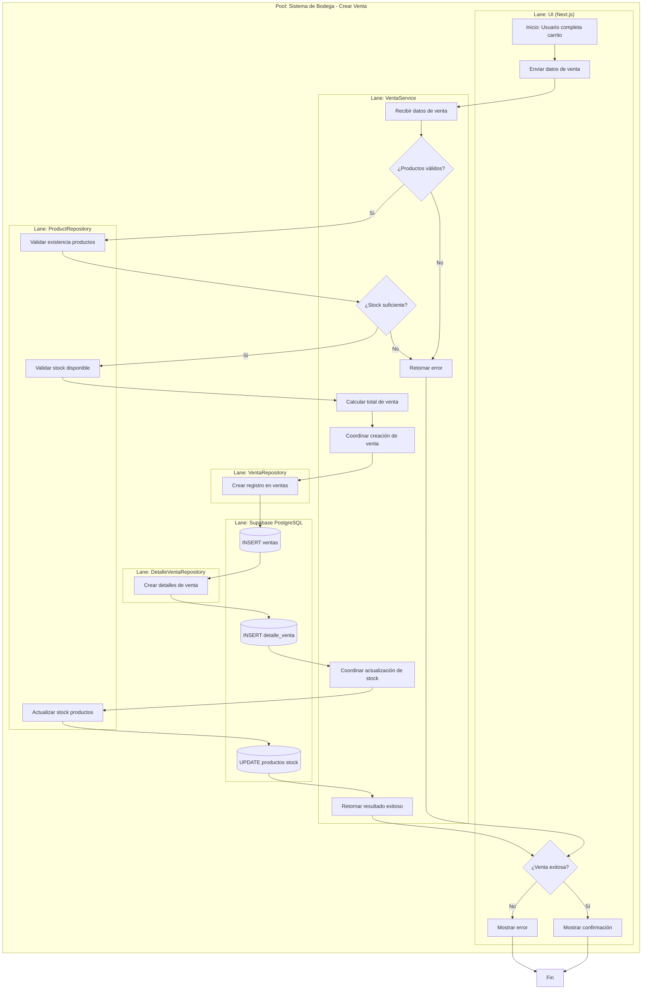
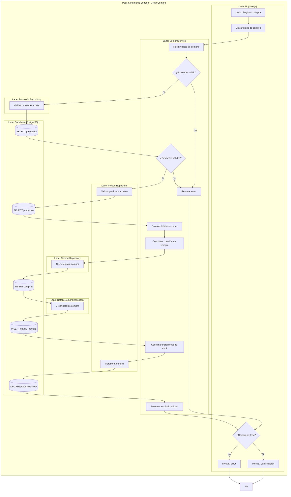
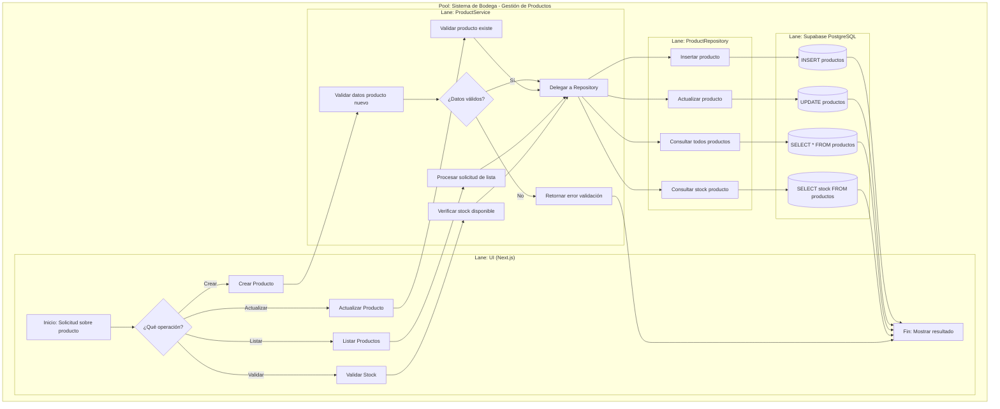
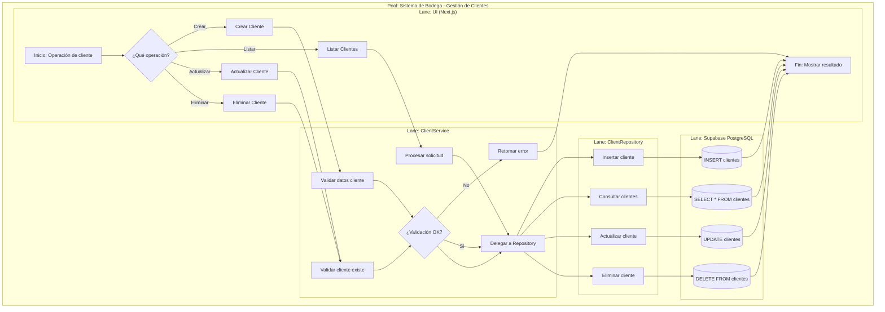
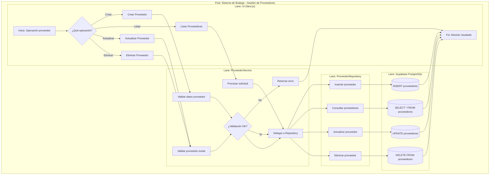
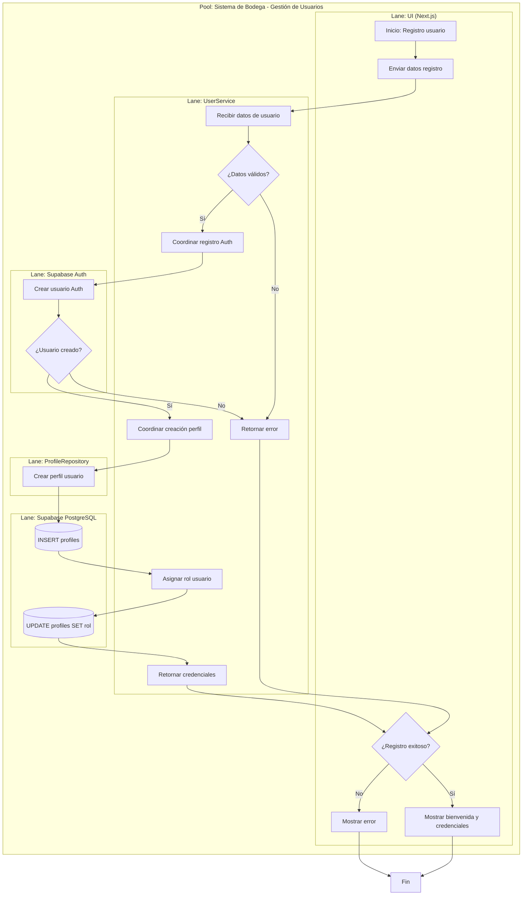

# 📊 Diagramas BPMN - Sistema SOA de Bodega

> Documentación completa de los procesos de negocio del sistema utilizando notación BPMN (Business Process Model and Notation)

---

## 📑 Índice

1. [Introducción](#-introducción)
2. [Arquitectura Reflejada en BPMN](#-arquitectura-reflejada-en-bpmn)
3. [VentaService - Crear Venta](#1-ventaservice---crear-venta)
4. [CompraService - Crear Compra](#2-compraservice---crear-compra)
5. [ProductService - Gestión de Productos](#3-productservice---gestión-de-productos)
6. [ClientService - Gestión de Clientes](#4-clientservice---gestión-de-clientes)
7. [ProveedorService - Gestión de Proveedores](#5-proveedorservice---gestión-de-proveedores)
8. [UserService - Autenticación](#6-userservice---autenticación-y-usuarios)
9. [Notación BPMN Utilizada](#-notación-bpmn-utilizada)
10. [Cómo Usar estos Diagramas](#-cómo-usar-estos-diagramas)

---

## 🎯 Introducción

Este documento contiene los **diagramas BPMN** de todos los servicios principales del sistema de bodega. Cada diagrama muestra el flujo completo de cada proceso de negocio, reflejando la **arquitectura SOA de 3 capas** implementada.

### ¿Qué es BPMN?

BPMN (Business Process Model and Notation) es un estándar internacional para modelar procesos de negocio de forma visual y comprensible, usado ampliamente en:
- Documentación de sistemas
- Análisis de procesos
- Optimización de flujos de trabajo
- Comunicación entre equipos técnicos y de negocio

---

## 🏗️ Arquitectura Reflejada en BPMN

Todos los diagramas siguen la **arquitectura de 3 capas** del sistema:

```
┌─────────────────────────────────────────┐
│     UI Layer (Next.js)                  │  ← Interfaz de usuario
├─────────────────────────────────────────┤
│     Service Layer (Lógica de Negocio)  │  ← Coordinación y validaciones
├─────────────────────────────────────────┤
│     Repository Layer (Acceso a Datos)  │  ← Operaciones de base de datos
├─────────────────────────────────────────┤
│     Database (Supabase PostgreSQL)     │  ← Almacenamiento persistente
└─────────────────────────────────────────┘
```

### Lanes en los Diagramas

Cada diagrama BPMN tiene **lanes** (carriles) que representan:

- **Lane UI**: Donde el usuario inicia y recibe resultados
- **Lane Service**: Lógica de negocio, validaciones y coordinación
- **Lane Repository**: Acceso directo a la base de datos
- **Lane Database**: Operaciones SQL en Supabase PostgreSQL

---

## 1. VentaService - Crear Venta

### 📋 Descripción del Proceso

El proceso de creación de venta es uno de los más complejos del sistema. Involucra:
- Validación de productos en el carrito
- Verificación de stock disponible
- Cálculo del total de la venta
- Creación del registro de venta
- Registro de detalles de cada producto vendido
- Actualización del inventario (descuento de stock)

### 🔄 Flujo del Proceso



### 📊 Tablas Involucradas

| Tabla | Operación | Descripción |
|-------|-----------|-------------|
| `ventas` | INSERT | Registro principal de la venta |
| `detalle_venta` | INSERT | Detalles de productos vendidos |
| `productos` | UPDATE | Descuento de stock |

### ⚠️ Validaciones Clave

1. ✅ Todos los productos deben existir
2. ✅ Stock suficiente para cada producto
3. ✅ Datos del cliente válidos (si aplica)
4. ✅ Método de pago válido

---

## 2. CompraService - Crear Compra

### 📋 Descripción del Proceso

El proceso de compra gestiona la adquisición de productos de proveedores:
- Validación del proveedor
- Validación de productos a comprar
- Cálculo del total de la compra
- Registro de la compra
- Registro de detalles
- Incremento del stock en inventario

### 🔄 Flujo del Proceso



### 📊 Tablas Involucradas

| Tabla | Operación | Descripción |
|-------|-----------|-------------|
| `proveedores` | SELECT | Validación del proveedor |
| `productos` | SELECT/UPDATE | Validación y actualización de stock |
| `compras` | INSERT | Registro principal de la compra |
| `detalle_compra` | INSERT | Detalles de productos comprados |

### ⚠️ Validaciones Clave

1. ✅ Proveedor debe existir y estar activo
2. ✅ Productos deben existir en el catálogo
3. ✅ Cantidades deben ser positivas
4. ✅ Precios de compra válidos

---

## 3. ProductService - Gestión de Productos

### 📋 Descripción del Proceso

El ProductService maneja todas las operaciones CRUD de productos:
- **Crear**: Registro de nuevos productos
- **Actualizar**: Modificación de datos existentes
- **Listar**: Consulta de todos los productos
- **Validar Stock**: Verificación de disponibilidad

### 🔄 Flujo del Proceso



### 📊 Operaciones Soportadas

| Operación | Método | Descripción |
|-----------|--------|-------------|
| Crear | `createProducto()` | Agregar nuevo producto al catálogo |
| Actualizar | `updateProducto()` | Modificar datos de producto existente |
| Listar | `getProductos()` | Obtener todos los productos |
| Eliminar | `deleteProducto()` | Eliminar producto del catálogo |
| Validar Stock | `validarStock()` | Verificar disponibilidad |

---

## 4. ClientService - Gestión de Clientes

### 📋 Descripción del Proceso

Gestión completa del ciclo de vida de clientes con validaciones específicas.

### 🔄 Flujo del Proceso



### ⚠️ Validaciones Específicas

1. ✅ Nombre es obligatorio
2. ✅ DNI único (si se proporciona)
3. ✅ Formato de correo válido
4. ✅ Teléfono con formato válido

---

## 5. ProveedorService - Gestión de Proveedores

### 📋 Descripción del Proceso

Similar a ClientService, pero con validaciones específicas para proveedores empresariales.

### 🔄 Flujo del Proceso



### ⚠️ Validaciones Específicas

1. ✅ Nombre de empresa obligatorio
2. ✅ RUC único (11 dígitos)
3. ✅ Datos de contacto válidos
4. ✅ No eliminar si tiene compras asociadas

---

## 6. UserService - Autenticación y Usuarios

### 📋 Descripción del Proceso

Proceso especial que integra **Supabase Auth** con la tabla de perfiles personalizada:
- Registro en sistema de autenticación
- Creación de perfil de usuario
- Asignación de roles
- Generación de credenciales

### 🔄 Flujo del Proceso



### 🔐 Roles del Sistema

| Rol | Permisos | Descripción |
|-----|----------|-------------|
| `admin` | Completo | Acceso total al sistema |
| `vendedor` | Limitado | Solo ventas y consultas |
| `almacenero` | Medio | Gestión de inventario y compras |

### ⚠️ Validaciones de Seguridad

1. ✅ Email único y válido
2. ✅ Contraseña fuerte (mínimo 8 caracteres)
3. ✅ Rol válido del sistema
4. ✅ Perfil creado correctamente

---

## 📘 Notación BPMN Utilizada

### Elementos Principales

| Símbolo | Nombre | Descripción |
|---------|--------|-------------|
| ⭕ | Evento de Inicio | Punto de inicio del proceso |
| ⭕⭕ | Evento de Fin | Punto de finalización del proceso |
| ▭ | Tarea/Actividad | Acción a realizar |
| ◇ | Gateway Exclusivo | Punto de decisión (una sola ruta) |
| 🗄️ | Base de Datos | Operación en base de datos |
| 🏊 | Pool | Proceso completo |
| 🏊‍♂️ | Lane | Participante/responsable |

### Convenciones en los Diagramas

- **Flechas sólidas**: Flujo secuencial del proceso
- **Texto en gateway**: Condición de la decisión
- **Cilindro con paréntesis**: Operación SQL específica
- **Colores**: Agrupación visual por responsabilidad

---

## 💡 Cómo Usar estos Diagramas

### Para Desarrollo
✅ Guía paso a paso para implementar cada servicio  
✅ Identificación clara de dependencias entre capas  
✅ Orden correcto de operaciones

### Para Documentación
✅ Explicar el sistema a nuevos desarrolladores  
✅ Onboarding de equipo  
✅ Documentación técnica del proyecto

### Para Presentaciones
✅ Demostrar arquitectura SOA implementada  
✅ Mostrar separación de responsabilidades  
✅ Explicar flujos complejos visualmente

### Para Testing
✅ Identificar casos de prueba por cada gateway  
✅ Detectar escenarios de error  
✅ Validar cobertura de pruebas

### Para Optimización
✅ Identificar cuellos de botella  
✅ Detectar redundancias  
✅ Proponer mejoras en flujos

---

## 🎓 Ventajas de la Arquitectura SOA

### 1. Separación de Responsabilidades
- UI solo presenta y captura datos
- Services contienen toda la lógica de negocio
- Repositories solo acceden a datos
- Database solo almacena

### 2. Mantenibilidad
- Cambios en UI no afectan lógica de negocio
- Cambios en DB no afectan servicios
- Código más limpio y organizado

### 3. Testabilidad
- Cada capa se puede testear independientemente
- Mocks más fáciles de crear
- Tests unitarios más simples

### 4. Escalabilidad
- Servicios pueden convertirse en microservicios
- Fácil agregar nuevos canales (mobile, API)
- Horizontal scaling por capa

### 5. Reutilización
- Services usables desde web, mobile, API
- Repositories compartidos entre services
- Lógica centralizada

---

## 📚 Referencias

- **BPMN 2.0**: [OMG BPMN Specification](https://www.omg.org/spec/BPMN/2.0/)
- **Mermaid Diagrams**: [Mermaid Documentation](https://mermaid.js.org/)
- **SOA Patterns**: [Service-Oriented Architecture Patterns](https://patterns.arcitura.com/soa-patterns)
- **Repository Pattern**: [Martin Fowler - Repository](https://martinfowler.com/eaaCatalog/repository.html)

---

## 📞 Información del Proyecto

**Proyecto**: Sistema de Bodega SOA  
**Tecnologías**: Next.js 14, TypeScript, Supabase, PostgreSQL  
**Arquitectura**: Service-Oriented Architecture (SOA) con Repository Pattern  
**Capas**: UI → Services → Repositories → Database

---

**Última actualización**: 2025-11-20  
**Versión**: 1.0  
**Estado**: ✅ Documentación Completa
